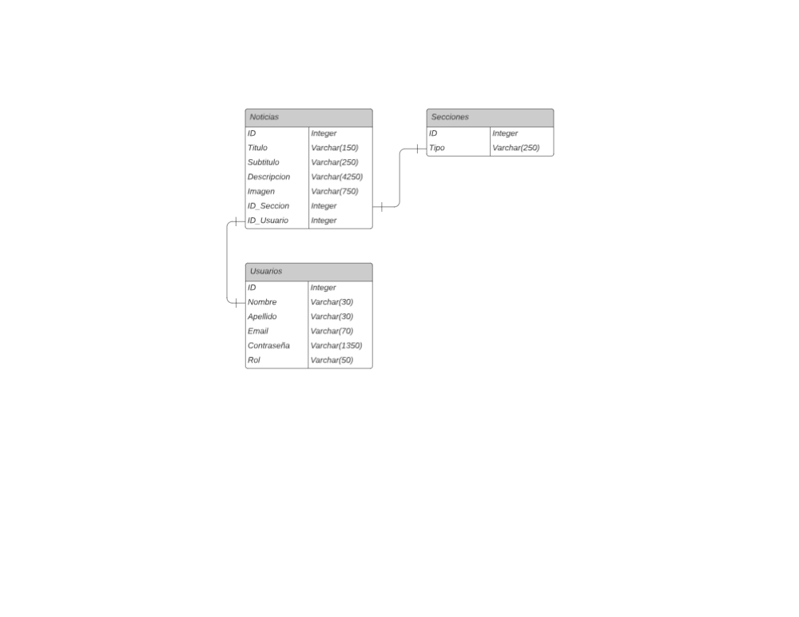

# tudai-web2-tpe
Repositorio público para Trabajo Práctico Especial de la materia WEB II de la carrera TUDAI en UNICEN

## Temática
Aplicacion de Fuente de Noticias sobre Criptomonedas y mundo de las criptos.

El usuario objetivo es el administrador que sube y administra las noticias y el consumidor quien puede interactuar con ellas.

## DER

## Autores

Este proyecto fue creado por:

- Federico Schuenemann fschuenemann2003@gmail.com
- Santiago Rui usuariosanti7a0@gmail.com
